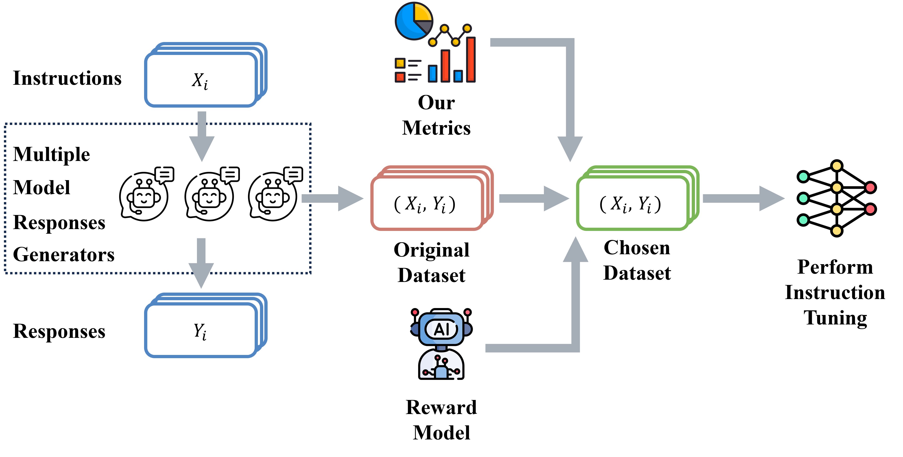
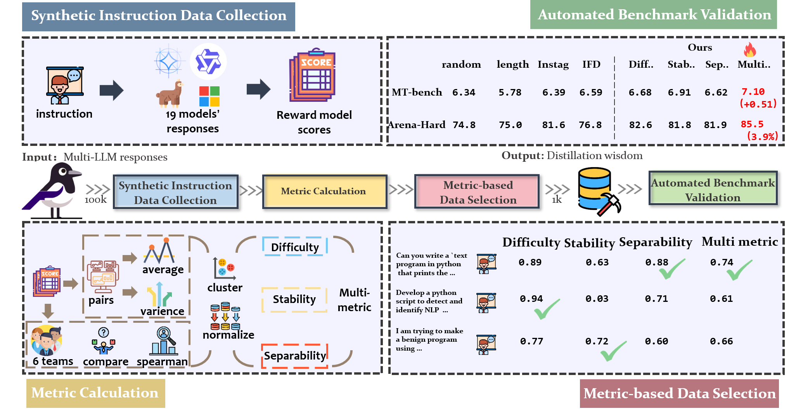
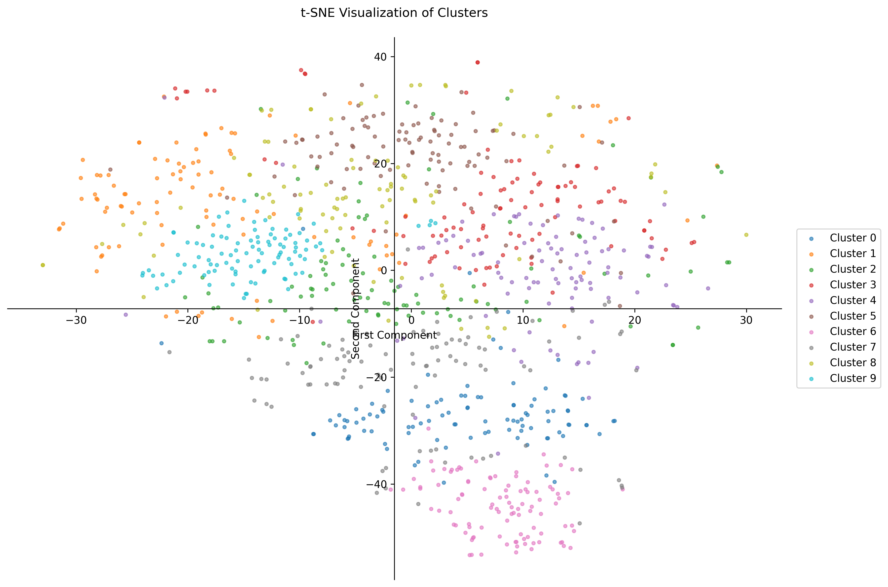
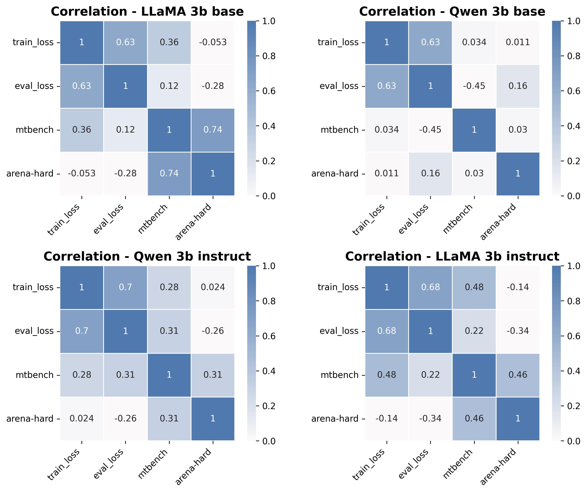
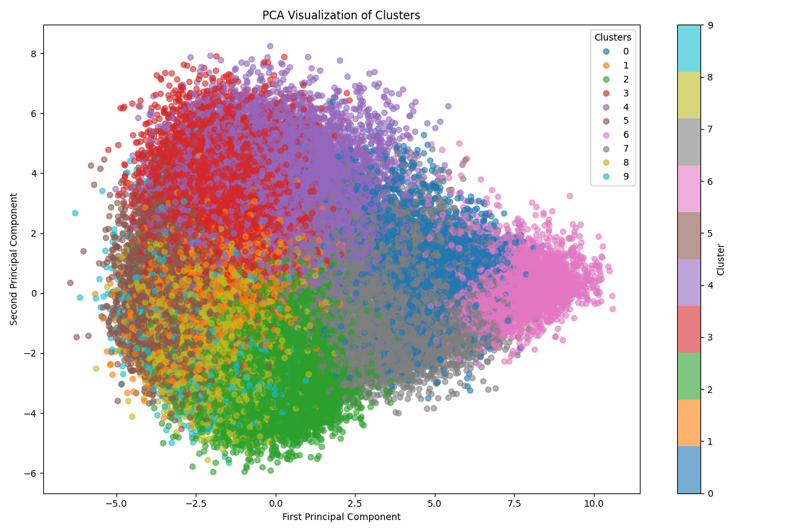
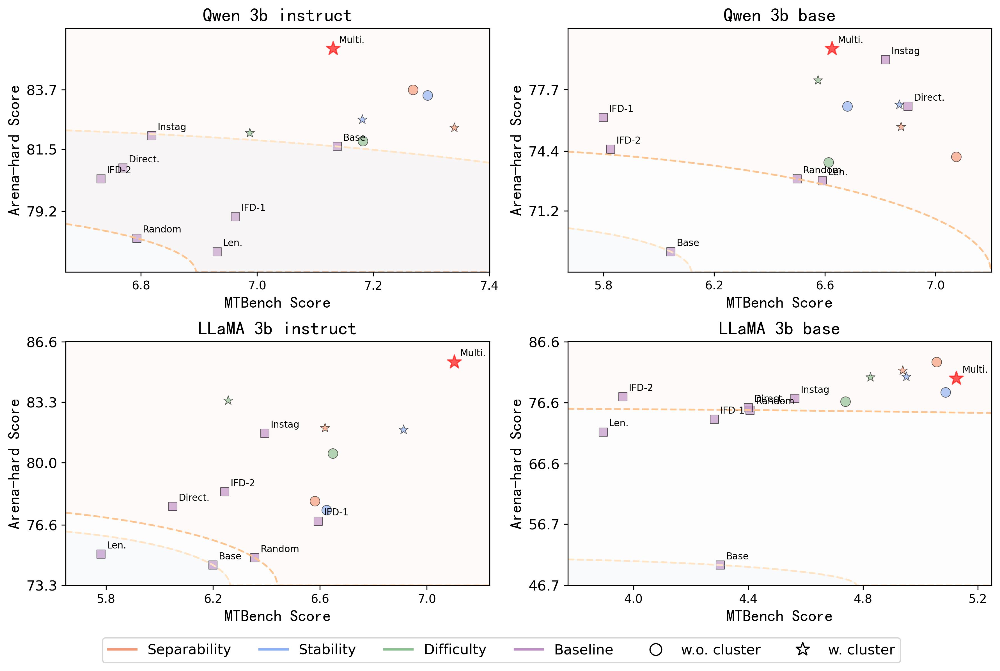

<p align="center">
  
</p>

# **CrowdSelect: Synthetic Instruction Data Selection with Multi-LLM Wisdom**
 

We investigate more diverse signals to capture comprehensive instruction-response pair characteristics and propose three foundation metrics that leverage Multi-LLM wisdom: (1) diverse responses across multiple LLMs and (2) reward model (RM) assessment.  


---

## Table of Contents  
1. [Project Overview](#project-overview)  
2. [Prepare Environment](#prepare-environment)  
3. [Reproducing the Baseline](#reproducing-the-baseline)  
4. [Single Metric Selection](#single-metric-selection)  
5. [Clustering](#clustering) 
6. [Multiple Metric Selection](#multiple-metric-selection) 
7. [Visualization](#visualization)  
8. [Dependencies](#dependencies)  
9. [License](#license)  

---

## Project Overview  

  

This is the repository for the CrowdSelect project. Our research, as shown in the figure above, is based on data generated by multiple LLMs. We combine our designed metrics and RM scores to select high-quality data for model fine-tuning. The specific steps are illustrated below.  

  

We calculate the average, variance, and Spearman correlation of RM scores. After clustering and normalization, we define three metrics: **difficulty**, **stability**, and **separability**. Based on these metrics, we derive a comprehensive **multi-metric** score.  

---

## Prepare Environment  
Clone this project, set up the conda environment, and use the `download_magpie_100k.py` script to download the dataset. Prepare the four open-source models (LLaMA 3B Base, LLaMA 3B Instruct, Qwen 3B, Qwen 3B Instruct).  

```bash  
git clone https://github.com/tianyi-lab/Cherry_LLM.git  
cd CROWDSELECT  
conda env create -f environment.yml  
conda activate crowdselect  
export CROWDSELECT_PATH='/home/xxx/CROWDSELECT' # Replace with your path  
python download_magpie_100k.py  
mkdir data  
python CrowdSelect/utils/choose_best_answer.py  
python CrowdSelect/utils/get_rm_score.py  
```  

**Model Download Links**:  
- LLaMA 3B Base: https://huggingface.co/meta-llama/Llama-3.2-3B  
- LLaMA 3B Instruct: https://huggingface.co/meta-llama/Llama-3.2-3B-Instruct  
- Qwen 3B: https://huggingface.co/Qwen/Qwen2.5-3B  
- Qwen 3B Instruct: https://huggingface.co/Qwen/Qwen2.5-3B-Instruct  

**Data Download Links**
put into data/ : https://drive.google.com/drive/folders/1DZxGNXyOdPo-iwyVroIzOZRCKk8bnHY0?usp=drive_link

**Folder Structure After Setup**:  
```  
CROWDSELECT/  
│── .git/                     # Git version control directory  
│── asset/                    # Resource files (e.g., images, pre-trained models)  
│── CrowdSelect/              # Main code directory  
│── data/                     # Data storage directory  
│── magpie_100k/              # Magpie-100K dataset directory  
│── opensource_models/        # Open-source models directory  
│── .gitattributes            # Git attributes file  
│── download_magpie_100k.py   # Script to download Magpie-100K dataset  
│── environment.yml           # Conda environment configuration file  
│── README.md                 # Project documentation  
```  

---

## Reproducing the Baseline  
We selected six baselines: **IFD**, **Instag**, **length**, **random**, **RM score**, and **direct score**. Among these, IFD is open-source, available at https://github.com/tianyi-lab/Cherry_LLM. The implementations of the other five baselines are located in `/CrowdSelect/baseline`. Follow the steps below:  

1. **length**:  
   This method sorts data based on token count. First, select the top 1k longest instructions, then the top 1k longest responses. The same applies for the shortest.  
   ```bash  
   python CrowdSelect/baseline/length/choose_long_1k.py  
   python CrowdSelect/baseline/length/choose_short_1k.py  
   ```  

2. **random**:  
   Randomly sample 1k instances. You can set `random_seeds` to change the sampling results.  
   ```bash  
   python CrowdSelect/baseline/random/random_choose_1k.py  
   ```  

3. **RM score**:  
   Select the top 1k (or bottom 1k) based on RM scores.  
   ```bash  
   python CrowdSelect/baseline/rm_score/get_top.py  
   python CrowdSelect/baseline/rm_score/get_bottom.py  
   ```  

4. **Instag**:  
   This method is based on the paper: "Instag: Instruction tagging for analyzing supervised fine-tuning of large language models."  
   ```bash  
   #python CrowdSelect/baseline/instag/get_tags.py  # Generates tags_info.data (already exists in data/)  
   python CrowdSelect/baseline/instag/choose_by_tag.py  
   ```  

5. **Direct score**:  
   This method is based on the paper: "Alpagasus: Training a better alpaca with fewer data." We used the instructions from the paper but replaced the judge model GPT4 with DeepSeek v3.  
   ```bash  
   python CrowdSelect/baseline/direct_score/direct_score.py # llm_score.json already exists in data/  
   python CrowdSelect/baseline/direct_score/choose_direct_score.py  
   ```  

---

## Single Metric Selection  
To perform selection based on a single metric:  

1. **Stability**:  
   First, generate `skywork_llama_stability_score.json` using `get_stability_score.py`, then select top and bottom based on the scores.  
   ```bash  
   python CrowdSelect/choose_single/stability/get_stability_score.py  
   python CrowdSelect/choose_single/stability/get_stability_top.py  
   python CrowdSelect/choose_single/stability/get_stability_bottom.py  
   ```  

2. **Difficulty**:  
   ```bash  
   python CrowdSelect/choose_single/difficulty/get_diff_score.py  
   python CrowdSelect/choose_single/difficulty/choose_by_difficulty.py  
   ```  

3. **Separability**:  
   ```bash  
   python CrowdSelect/choose_single/separability/get_sep_score.py  
   python CrowdSelect/choose_single/separability/choose_by_separability.py  
   ```  

---

## Clustering  
To perform clustering:  

1. **Get Embedding**:  
   ```bash  
   python CrowdSelect/utils/get_embedding.py # Embedding already exists in data/  
   ```  

2. **Clustering**:  
   ```bash  
   python CrowdSelect/cluster_choose/make_cluster.py  # clusters_30.json already exists in data/  
   python CrowdSelect/cluster_choose/split_uuid_by_cluster.py  
   ```  

3. **Choose**:  
   Based on clustering results, select using **stability**, **difficulty**, and **separability**.  
   ```bash  
   python CrowdSelect/cluster_choose/cluster_choose_difficulty.py  
   python CrowdSelect/cluster_choose/cluster_choose_separability.py  
   python CrowdSelect/cluster_choose/cluster_choose_stability.py  
   ```  

---

## Multiple Metric Selection  
To perform selection based on multiple metrics:  

1. **Get All Scores**:  
   ```bash  
   python CrowdSelect/choose_multi/put_all_score_to_item.py  
   ```  

2. **Multi Choose**:  
   ```bash  
   python CrowdSelect/choose_multi/multi_choose.py  
   ```  

---

## Visualization  
This section showcases our results compared to traditional methods.  

1. **Cluster**:
     

2. **Correlation**:  
     

3. **PCA**:  
     

4. **MT-bench && Arena-Hard Results**:  
     

---

## License  
This project is licensed under the MIT License. See the `LICENSE` file for details.  

